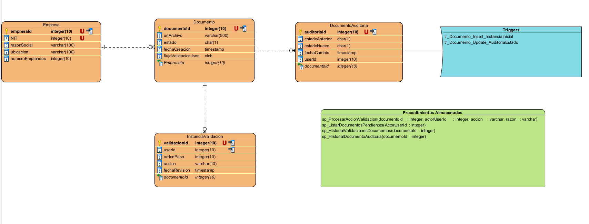

# Sistema de Gestión de Documentos

Sistema de gestión de documentos con flujo de validación configurable mediante JSON. Este proyecto implementa una API REST en ASP.NET Core que permite la creación, validación y seguimiento de documentos con múltiples niveles de aprobación.

## Características principales

- Gestión de documentos con estados: Pendiente (P), Aprobado (A), Rechazado (R)
- Flujo de validación configurable mediante JSON
- Validación secuencial por múltiples usuarios
- Auditoría automática de cambios de estado
- Historial completo de validaciones
- Asociación de documentos con empresas

## Tecnologías utilizadas

- .NET 10.0
- ASP.NET Core Web API
- Entity Framework Core 10.0
- SQL Server
- Stored Procedures y Triggers

## Estructura de la base de datos

El sistema utiliza cuatro tablas principales:

- **EMPRESA**: Información de las empresas
- **DOCUMENTO**: Documentos con su estado y flujo de validación
- **INSTANCIA_VALIDACION**: Registro de cada acción de validación
- **DOCUMENTO_AUDITORIA**: Auditoría de cambios de estado

## Diagrama Entidad Relación (ERD)



## Configuración inicial

### 1. Crear la base de datos

Ejecutar los scripts SQL, ubicados en el repositorio, en el siguiente orden:

-- DDL_Script
-- Script_Stored_Procedures
-- Script_Triggers

#### 1.Stored Procedures

**sp_ProcesarAccionValidacion**: Procesa aprobaciones y rechazos de documentos

**sp_sp_ListarDocumentosPendientes**: Muestra la lista de documentos que no se encuentran aprobados

**sp_HistorialValidacionesDocumentos**: Consulta el historial de validaciones

**sp_HistorialDocumentoAuditoria**: Consulta el historial de auditoría


### 2. Configurar la cadena de conexión

Editar el archivo `appsettings.json` o `appsettings.Development.json`:

```json
{
  "ConnectionStrings": {
    "DefaultConnection": "Server=localhost;Database=Prueba_Documentos_ERP;Integrated Security=True;TrustServerCertificate=True;"
  }
}
```

Opciones de cadena de conexión:

**Autenticación de Windows:**
```
Server=localhost;Database=Prueba_Documentos_ERP;Integrated Security=True;TrustServerCertificate=True;
```

**Autenticación SQL Server:**
```
Server=localhost;Database=Prueba_Documentos_ERP;User Id=sa;Password=YourPassword;TrustServerCertificate=True;
```

### 3. Ejecutar la API

#### Desde CLI

```bash
cd GestionDocumentos
dotnet restore
dotnet build
dotnet run
```

La API estará disponible en `http://localhost:5000`

## Formato del flujo de validación JSON

El campo `flujoValidacionJson` define los pasos de validación que debe seguir un documento. Cada paso tiene un orden secuencial y un usuario asignado.

### Estructura del JSON

```json
{
  "steps": [
    {
      "order": 1,
      "userId": "11111111-1111-1111-1111-111111111111",
      "role": "Supervisor"
    },
    {
      "order": 2,
      "userId": "22222222-2222-2222-2222-222222222222",
      "role": "Gerente"
    },
    {
      "order": 3,
      "userId": "33333333-3333-3333-3333-333333333333",
      "role": "Director"
    }
  ]
}
```

### Reglas de validación

- Los usuarios deben aprobar en el orden especificado (secuencial)
- Un usuario no puede aprobar si hay pasos anteriores pendientes
- Si un usuario rechaza, el documento pasa a estado "R" (Rechazado)
- Solo cuando todos los usuarios aprueban, el documento pasa a estado "A" (Aprobado)

## Ejemplos de uso de la API con Postman

### 1. Crear una empresa

**Método:** POST  
**URL:** `http://localhost:5000/api/empresas`  
**Headers:**
- Content-Type: `application/json`

**Body (raw - JSON):**
```json
{
  "nit": 900123456,
  "razonSocial": "Empresa de Prueba S.A.S.",
  "ubicacion": "Bogotá, Colombia",
  "numeroEmpleados": 50
}
```

**Respuesta esperada:**
```json
{
  "empresaId": "a1b2c3d4-e5f6-7890-abcd-ef1234567890",
  "nit": 900123456,
  "razonSocial": "Empresa de Prueba S.A.S.",
  "ubicacion": "Bogotá, Colombia",
  "numeroEmpleados": 50
}
```

### 2. Crear un documento

**Método:** POST  
**URL:** `http://localhost:5000/api/documents`  
**Headers:**
- Content-Type: `application/json`

**Body (raw - JSON):**
```json
{
  "empresaId": "a1b2c3d4-e5f6-7890-abcd-ef1234567890",
  "urlArchivo": "https://storage.example.com/documentos/contrato-2025.pdf",
  "flujoValidacionJson": "{\"steps\":[{\"order\":1,\"userId\":\"11111111-1111-1111-1111-111111111111\",\"role\":\"Supervisor\"},{\"order\":2,\"userId\":\"22222222-2222-2222-2222-222222222222\",\"role\":\"Gerente\"},{\"order\":3,\"userId\":\"33333333-3333-3333-3333-333333333333\",\"role\":\"Director\"}]}"
}
```

**Respuesta esperada:**
```json
{
  "documentoId": "12345678-90ab-cdef-1234-567890abcdef",
  "empresaId": "a1b2c3d4-e5f6-7890-abcd-ef1234567890",
  "urlArchivo": "https://storage.example.com/documentos/contrato-2025.pdf",
  "estado": "P",
  "fechaCreacion": "2025-11-30T10:30:00",
  "flujoValidacionJson": "{\"steps\":[...]}"
}
```

### 3. Aprobar un documento

#### Aprobación del primer usuario (order: 1)

**Método:** POST  
**URL:** `http://localhost:5000/actions/12345678-90ab-cdef-1234-567890abcdef`  
**Headers:**
- Content-Type: `application/json`

**Body (raw - JSON):**
```json
{
  "actorUserId": "11111111-1111-1111-1111-111111111111",
  "accion": "Aprobar",
  "razon": "Documento cumple con los requisitos establecidos"
}
```

**Respuesta esperada:**
```json
{
  "message": "Acción procesada exitosamente",
  "documentId": "12345678-90ab-cdef-1234-567890abcdef",
  "nuevoEstado": "P",
  "fechaCreacion": "2025-11-30T10:30:00"
}
```

#### Aprobación del segundo usuario (order: 2)

**Método:** POST  
**URL:** `http://localhost:5000/actions/12345678-90ab-cdef-1234-567890abcdef`  
**Headers:**
- Content-Type: `application/json`

**Body (raw - JSON):**
```json
{
  "actorUserId": "22222222-2222-2222-2222-222222222222",
  "accion": "Aprobar",
  "razon": "Revisado y aprobado"
}
```

#### Aprobación del tercer usuario (order: 3) - Aprobación final

**Método:** POST  
**URL:** `http://localhost:5000/actions/12345678-90ab-cdef-1234-567890abcdef`  
**Headers:**
- Content-Type: `application/json`

**Body (raw - JSON):**
```json
{
  "actorUserId": "33333333-3333-3333-3333-333333333333",
  "accion": "Aprobar",
  "razon": "Aprobación final"
}
```

**Respuesta esperada:**
```json
{
  "message": "Acción procesada exitosamente",
  "documentId": "12345678-90ab-cdef-1234-567890abcdef",
  "nuevoEstado": "A",
  "fechaCreacion": "2025-11-30T10:30:00"
}
```

### 4. Rechazar un documento

Cualquier usuario del flujo puede rechazar en cualquier momento:

**Método:** POST  
**URL:** `http://localhost:5000/actions/12345678-90ab-cdef-1234-567890abcdef`  
**Headers:**
- Content-Type: `application/json`

**Body (raw - JSON):**
```json
{
  "actorUserId": "22222222-2222-2222-2222-222222222222",
  "accion": "Rechazar",
  "razon": "Información incompleta en la sección 3"
}
```

**Respuesta esperada:**
```json
{
  "message": "Acción procesada exitosamente",
  "documentId": "12345678-90ab-cdef-1234-567890abcdef",
  "nuevoEstado": "R",
  "fechaCreacion": "2025-11-30T10:30:00"
}
```

### 5. Consultar un documento

**Método:** GET  
**URL:** `http://localhost:5000/api/documents/12345678-90ab-cdef-1234-567890abcdef/download`

**Respuesta esperada:**
```json
{
  "documentId": "12345678-90ab-cdef-1234-567890abcdef",
  "estado": "A",
  "urlDescarga": "https://storage.example.com/documentos/contrato-2025.pdf",
  "fechaCreacion": "2025-11-30T10:30:00",
  "flujoValidacionJson": "{\"steps\":[...]}",
  "empresa": {
    "id": "a1b2c3d4-e5f6-7890-abcd-ef1234567890",
    "razonSocial": "Empresa de Prueba S.A.S.",
    "nit": 900123456
  },
  "validaciones": [
    {
      "id": "val-001",
      "userId": "11111111-1111-1111-1111-111111111111",
      "ordenPaso": 1,
      "accion": "Aprobar",
      "fechaRevision": "2025-11-30T11:00:00"
    },
    {
      "id": "val-002",
      "userId": "22222222-2222-2222-2222-222222222222",
      "ordenPaso": 2,
      "accion": "Aprobar",
      "fechaRevision": "2025-11-30T11:30:00"
    },
    {
      "id": "val-003",
      "userId": "33333333-3333-3333-3333-333333333333",
      "ordenPaso": 3,
      "accion": "Aprobar",
      "fechaRevision": "2025-11-30T12:00:00"
    }
  ]
}
```

### 6. Consultar historial de validaciones

**Método:** GET  
**URL:** `http://localhost:5000/api/validaciones/historial/12345678-90ab-cdef-1234-567890abcdef`

**Respuesta esperada:**
```json
[
  {
    "validacionId": "val-001",
    "userId": "11111111-1111-1111-1111-111111111111",
    "ordenPaso": 1,
    "accion": "Aprobar",
    "fechaRevision": "2025-11-30T11:00:00"
  },
  {
    "validacionId": "val-002",
    "userId": "22222222-2222-2222-2222-222222222222",
    "ordenPaso": 2,
    "accion": "Aprobar",
    "fechaRevision": "2025-11-30T11:30:00"
  },
  {
    "validacionId": "val-003",
    "userId": "33333333-3333-3333-3333-333333333333",
    "ordenPaso": 3,
    "accion": "Aprobar",
    "fechaRevision": "2025-11-30T12:00:00"
  }
]
```

### 7. Consultar historial de auditoría

**Método:** GET  
**URL:** `http://localhost:5000/api/auditorias/historial/12345678-90ab-cdef-1234-567890abcdef`

**Respuesta esperada:**
```json
[
  {
    "auditoriaId": "aud-001",
    "estadoAnterior": "P",
    "estadoNuevo": "A",
    "fechaCambio": "2025-11-30T12:00:00",
    "userId": "33333333-3333-3333-3333-333333333333"
  }
]
```

## Endpoints disponibles

### Empresas
- `POST /api/empresas` - Crear empresa
- `GET /api/empresas` - Listar todas las empresas
- `GET /api/empresas/{id}` - Obtener empresa por ID
- `GET /api/empresas/nit/{nit}` - Obtener empresa por NIT
- `PUT /api/empresas/{id}` - Actualizar empresa
- `DELETE /api/empresas/{id}` - Eliminar empresa

### Documentos
- `POST /api/documents` - Crear documento
- `POST /actions/{documentId}` - Procesar acción de validación (aprobar/rechazar)
- `GET /api/documents/{documentId}` - Obtener documento por ID
- `GET /api/documents/{documentId}/download` - Obtener documento con detalles completos

### Validaciones
- `GET /api/validaciones` - Listar todas las validaciones
- `GET /api/validaciones/{id}` - Obtener validación por ID
- `GET /api/validaciones/documento/{documentoId}` - Listar validaciones de un documento
- `GET /api/validaciones/historial/{documentoId}` - Historial de validaciones (SP)
- `GET /api/validaciones/usuario/{userId}` - Validaciones por usuario

### Auditorías
- `GET /api/auditorias` - Listar todas las auditorías
- `GET /api/auditorias/{id}` - Obtener auditoría por ID
- `GET /api/auditorias/documento/{documentoId}` - Auditorías de un documento
- `GET /api/auditorias/historial/{documentoId}` - Historial de auditoría (SP)
- `GET /api/auditorias/usuario/{userId}` - Auditorías por usuario

## Estados de documento

- `P` - Pendiente: El documento está en proceso de validación
- `A` - Aprobado: El documento ha sido aprobado por todos los validadores
- `R` - Rechazado: El documento fue rechazado por al menos un validador

## Reglas de negocio

1. Un documento inicia en estado "P" (Pendiente)
2. Los usuarios deben aprobar en orden secuencial según el `order` definido en el JSON
3. Un usuario no puede aprobar si hay pasos previos sin aprobar
4. Si un usuario rechaza, el documento pasa inmediatamente a estado "R"
5. Solo cuando todos los usuarios aprueban, el documento pasa a estado "A"
6. Todas las acciones quedan registradas en `INSTANCIA_VALIDACION`
7. Todos los cambios de estado quedan registrados en `DOCUMENTO_AUDITORIA`
